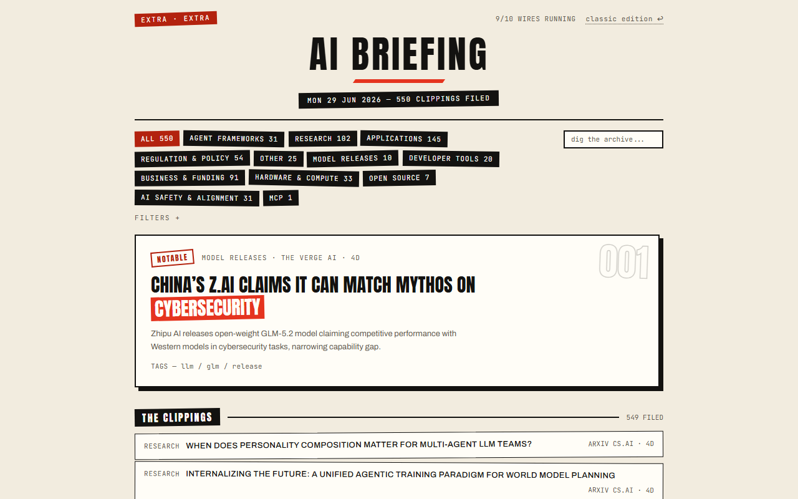
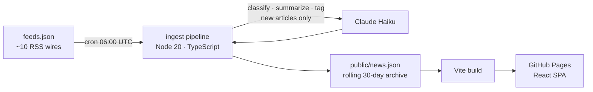

# AI Briefing

> A self-updating front page for the AI industry — RSS feeds ingested daily,
> classified, tagged and summarized by Claude, published as a zero-cost static
> site.

**[Read today's briefing →](https://marco144803025.github.io/AI-News-Reader/)**

[](https://github.com/marco144803025/AI-News-Reader/actions/workflows/test.yml)
[](https://github.com/marco144803025/AI-News-Reader/actions/workflows/ingest.yml)



*Shown: the "Stop the Presses" edition (`?theme=extra`) — a punk-newsprint
redesign with a ranked front page. A quieter dark terminal edition is the
default; both run on identical data and logic behind an A/B theme flag.*

## Features

- **Autonomous daily pipeline** — a GitHub Actions cron (06:00 UTC) pulls ~10
  RSS wires, dedupes against a rolling 30-day archive, and has Claude
  classify, summarize and tag only the new articles. A typical run costs a
  few cents.
- **12-category taxonomy + 3-dimensional tags** (topics / traits / entities),
  with notable-story detection for significant releases, papers, funding
  rounds and policy moves.
- **Client-side search and multi-select tag filters** with URL-shareable
  state — every filtered view is a link.
- **Two complete design lineages** behind a theme flag: the dark
  intelligence-terminal classic, and the newsprint-collage extra edition with
  a ranked front page (lead clipping, fresh markers, tilted wire rows).
- **Per-feed health tracking** — failing wires are recorded across runs and
  surfaced in the UI.
- **Zero runtime cost** — no server, no database; the whole product is a
  static build on GitHub Pages.

## How it works



The ingest is idempotent and incremental: already-classified articles are
never re-sent to the model, transient API errors retry with backoff, and a
run with zero new articles still prunes the archive and records feed health.

## Stack

- **UI:** React 19, TypeScript, Vite 7, Tailwind 4 — static SPA, no client
  data fetching beyond one `news.json`.
- **Pipeline:** Node 20 ESM, `@anthropic-ai/sdk` (Claude Haiku for batch
  classification), `rss-parser`.
- **Tests:** `node:test` over the ingest library and UI logic (filtering,
  ranking, pagination, theming) — gated in CI on every PR and before every
  scheduled ingest.
- **CI/CD:** three GitHub Actions workflows — test gate, push-to-deploy, and
  the daily ingest + deploy cron.

## Run it yourself

```bash
git clone https://github.com/marco144803025/AI-News-Reader.git
cd AI-News-Reader
npm install
cp .env.example .env   # set ANTHROPIC_API_KEY

npm run ingest         # fetch + classify (costs a few cents)
npm run dev            # http://localhost:5173/AI-News-Reader/
npm test
```

Feeds live in [feeds.json](feeds.json) — each entry is
`{ "name": "...", "url": "..." }`; broken feeds are skipped and tracked.

## Process

Every feature ships through a spec-driven workflow: an approved `spec.md`
(what/why) and `plan.md` (how) precede any code — see
[specs/](specs/README.md), the project [constitution](specs/CONSTITUTION.md)
and [roadmap](specs/ROADMAP.md). Interface decisions are documented in
[.interface-design/system.md](.interface-design/system.md).

## License

[MIT](LICENSE). Fonts (Anton, Archivo, JetBrains Mono) are bundled under the
[SIL OFL](public/fonts/OFL-Anton.txt).
