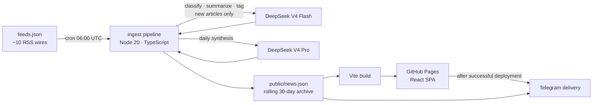

# AI Briefing

> A self-updating front page for the AI industry — RSS feeds ingested daily,
> classified, tagged and summarized by DeepSeek, published as a zero-cost static
> site.

**[Read today's briefing →](https://marco144803025.github.io/AI-News-Reader/)**

[](https://github.com/marco144803025/AI-News-Reader/actions/workflows/test.yml)
[](https://github.com/marco144803025/AI-News-Reader/actions/workflows/ingest.yml)


*The standard edition: a dark editorial Daily Brief, notable stories, and a
full news feed below the cover. The optional Stop the Presses edition is
retained behind a build-time flag that is disabled by default.*

## Features

- **Autonomous daily pipeline** — a GitHub Actions cron (06:00 UTC) pulls ~10
  RSS wires, dedupes against a rolling 30-day archive, and has DeepSeek
  classify, summarize and tag only the new articles. Model API usage is paid.
- **English / 繁體中文** — the standard edition switches its entire interface,
  article summaries and Daily Brief together, remembering your choice after reload.
  Navigation, filters, dates, Trends and source-health labels use Hong Kong
  Traditional Chinese even when content falls back to English. Original article
  titles, proper names, source links and stored filter values remain unchanged;
  unknown dynamic labels retain their original spelling. Extra retains its
  summary-language switch. Search matches both content languages; interface
  translations are local and require no AI calls.
- **12-category taxonomy + 3-dimensional tags** (topics / traits / entities),
  with notable-story detection for significant releases, papers, funding
  rounds and policy moves.
- **Client-side search and multi-select tag filters** with URL-shareable
  state — every filtered view is a link.
- **Brief-first editorial design** — an animated particle cover, up to two
  notable stories, full summaries, eight-item pages, and a compact category
  index on desktop and phone. Motion respects your device preference and
  can be turned off in the index; the art pauses outside the visible cover.
- **Optional Extra edition** — the preserved newsprint-collage design can be
  enabled with `VITE_ENABLE_EXTRA=true`. Old Extra URLs/preferences cannot
  bypass a disabled flag.
- **Per-feed health tracking** — failing wires are recorded across runs and
  surfaced in the UI.
- **Personal Telegram brief** — optional delivery of the cited morning summary
  after deployment, defaulting to Traditional Chinese, with an offline preview
  and durable duplicate protection. Set `TELEGRAM_LANGUAGE=en` to use English.
  [Set up your personal bot](docs/telegram-setup.md).
- **Zero runtime cost** — no server, no database; the whole product is a
  static build on GitHub Pages.

## How it works


```mermaid
flowchart LR
    F[feeds.json<br/>~10 RSS wires] -->|cron 06:00 UTC| I[ingest pipeline<br/>Node 20 · TypeScript]
    I -->|classify · summarize · tag<br/>new articles only| C[DeepSeek V4 Flash]
    C --> I
    I -->|daily synthesis| D[DeepSeek V4 Pro]
    D --> I
    I --> J[public/news.json<br/>rolling 30-day archive]
    J --> B[Vite build]
    B --> P[GitHub Pages<br/>React SPA]
    P -->|after successful deployment| T[Telegram delivery]
    J --> T
```

The ingest is idempotent and incremental: already-classified articles are
never re-sent to the model, transient API errors retry with backoff, and a
run with zero new articles still prunes the archive and records feed health.

New ingestion requests English and HK Traditional Chinese summaries together
in each existing classification/brief call, storing optional `summaryZhHK` and
`textZhHK` alongside the English fields. Both versions share source citations.
Bilingual output increases model tokens and may increase generation time; the
same call count does not imply the same bill. Switching language and sending
Telegram do not make translation calls.

The website starts in English and remembers your explicit choice in localStorage.
In the standard edition, the switch changes the entire interface, summaries and
Daily Brief together. Extra changes summary content only; its compact rows remain headline-only.
Old articles without Chinese show
English with a visible fallback notice. A partially translated daily brief
falls back entirely to English. There is no automatic paid archive translation.

The Daily Brief headline and its Chinese equivalent are generated in the same
synthesis call as the bullets. Older briefs show “The latest in AI.” / “AI 每日摘要”
until a normal ingestion produces the new optional fields; no backfill is needed.
A missing headline translation does not discard already-translated bullets.
The brief's date stays visible when a quiet or failed update carries it forward.

## Stack

- **UI:** React 19, TypeScript, Vite 7, Tailwind 4 — static SPA, no client
  data fetching beyond one `news.json`.
- **Pipeline:** Node 20 ESM, `openai` SDK configured for DeepSeek (V4 Flash for
  classification, V4 Pro for the brief), `rss-parser`. Model thinking is disabled
  for these bounded structured-output requests; the application owns retries.
- **Tests:** `node:test` over the ingest library and UI logic (filtering,
  ranking, pagination, theming) — gated in CI on every PR and before every
  scheduled ingest.
- **CI/CD:** three GitHub Actions workflows — test gate, push-to-deploy, and
  the daily ingest + deploy cron.

## Run it yourself

```cmd
git clone https://github.com/marco144803025/AI-News-Reader.git
cd AI-News-Reader
npm install
if not exist .env copy .env.example .env
notepad .env

npm run ingest
npm run dev
npm test
```

Set `DEEPSEEK_API_KEY` in `.env` before ingestion. Obtain it from the
[DeepSeek platform](https://platform.deepseek.com/api_keys); the key needs a
funded API account. Ingestion makes paid API requests and updates the local
archive. The dev server opens at `http://localhost:5173/AI-News-Reader/`.
Existing archives remain compatible; no backfill is required for the migration.

For scheduled ingestion, open the repository's **Settings → Secrets and
variables → Actions → Secrets → New repository secret**. Set the name to
`DEEPSEEK_API_KEY` and paste its value. The workflow reads that secret only in
the offline ingest step. It no longer uses `ANTHROPIC_API_KEY`; any old secret
can remain unused until you choose to remove it. Never use a `VITE_` prefix
for API keys. `.env` is ignored by Git and secrets never belong in browser code.

Preview the existing brief without network requests using
`npm run telegram:preview`. Follow the [Telegram setup guide](docs/telegram-setup.md)
for BotFather, chat ID discovery, GitHub secrets, sending, and recovery.

Feeds live in [feeds.json](feeds.json) — each entry is
`{ "name": "...", "url": "..." }`; broken feeds are skipped and tracked.

## Optional Extra edition

The standard edition is always the default for a new visitor. Only the exact
value `true` enables Extra; unset, `false`, and unrecognized values disable it.
This is a public presentation flag, not a secret. API keys still belong only
in offline ingestion settings.

For a local session (Windows cmd), restart Vite after changing the flag:

```cmd
set VITE_ENABLE_EXTRA=true
npm run dev
```

Choose **Index → Extra edition**, or open `?theme=extra`. With the flag enabled,
a recognized URL theme wins over the saved choice. `?theme=classic` refers to
the cinematic standard. To return to the default configuration:

```cmd
set VITE_ENABLE_EXTRA=false
npm run build
npm run dev
```

For hosted builds, set the repository's **Settings → Secrets and variables →
Actions → Variables → New repository variable** named `VITE_ENABLE_EXTRA` to
`true`. Both `deploy.yml` and `ingest.yml` read the same variable at build time.
Set it to `false` or remove it to disable Extra. A subsequent build/deployment
is required; changing a URL cannot enable a disabled build. No hosted setting
is changed by a local build.

## Process

Every feature ships through a spec-driven workflow: an approved `spec.md`
(what/why) and `plan.md` (how) precede any code — see
[specs/](specs/README.md), the project [constitution](specs/CONSTITUTION.md)
and [roadmap](specs/ROADMAP.md). Interface decisions are documented in
[.interface-design/system.md](.interface-design/system.md).

## License

[MIT](LICENSE). Fonts (Anton, Archivo, JetBrains Mono) are bundled under the
[SIL OFL](public/fonts/OFL-Anton.txt).
